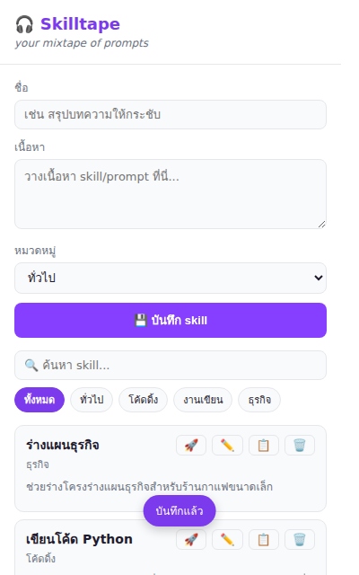
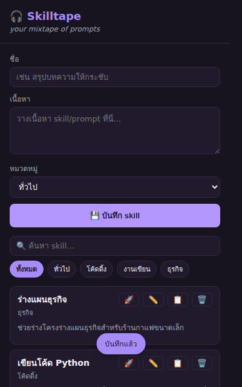
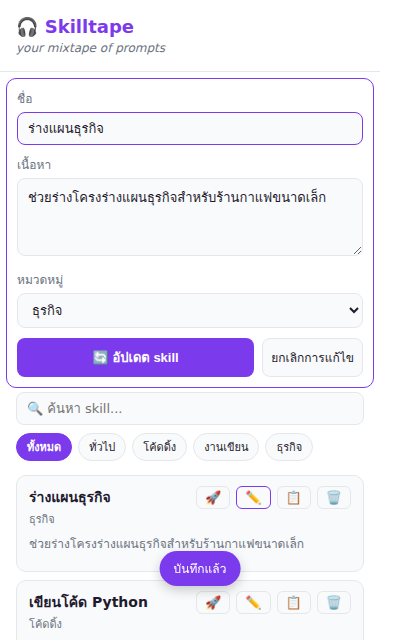

# Skilltape 🎧

> your mixtape of prompts

Chrome Extension (Manifest V3) สำหรับจัดเก็บ Skill/Prompt ของคุณ และแทรกลงช่องแชท
ของเว็บ AI **ไหนก็ได้** ในคลิกเดียว — ไม่มี dependency, ไม่มี build step,
เขียนด้วย vanilla JavaScript (ES2022) ล้วน

**สถานะ:** พัฒนาเสร็จสมบูรณ์ พร้อมใช้งานจริงและพร้อมแพ็กสำหรับอัปโหลด
Chrome Web Store

## Screenshots

| ธีมสว่าง | ธีมมืด | โหมดแก้ไข |
|:---:|:---:|:---:|
|  |  |  |

---

## ติดตั้ง (โหมดนักพัฒนา)

1. เปิด `chrome://extensions`
2. เปิดสวิตช์ **Developer mode** (มุมขวาบน)
3. คลิก **Load unpacked** แล้วเลือกโฟลเดอร์นี้ (โฟลเดอร์ที่มี `manifest.json`)
4. ไอคอน Skilltape จะปรากฏบน toolbar

**เว็บไซต์ที่รองรับการแทรกข้อความ:** ทุกเว็บไซต์ (content script รันบนทุก
http/https page แล้วหาช่องพิมพ์ข้อความแบบทั่วไป ไม่ผูกกับเว็บใดเว็บหนึ่ง —
ใช้ได้กับ ChatGPT, Claude, Gemini, Perplexity, Copilot ฯลฯ)

---

## ฟีเจอร์

- **เพิ่ม/แก้ไข/ลบ** skill ผ่านฟอร์ม (ชื่อ, เนื้อหา, หมวดหมู่) พร้อม validation
  ภาษาไทย — แก้ไขโดยกด ✏️ ที่รายการ ฟอร์มจะโหลดค่าเดิมขึ้นมาให้แก้แล้วอัปเดต
  โดยไม่สร้างรายการซ้ำ
- **🚀 Use** — ส่งเนื้อหา skill ไปแทรกในช่องแชทของแท็บ AI ที่เปิดอยู่ทันที
- **ลากการ์ด skill** (`draggable`) ไปวางในช่องพิมพ์ของหน้าเว็บได้โดยตรงผ่าน
  native HTML5 drag-and-drop — ทางเลือกเสริมนอกจากปุ่ม 🚀 Use
  (ดูข้อจำกัดด้านล่าง)
- **📋 คัดลอก** เนื้อหา skill ไปยัง clipboard
- **ค้นหาแบบ realtime** (debounce 150ms) ครอบคลุมชื่อ เนื้อหา หมวดหมู่ และ tags
  พร้อมตัวนับผลลัพธ์ "พบ X skills"
- **กรองตามหมวดหมู่** ด้วย chip (ทั้งหมด/ทั่วไป/โค้ดดิ้ง/งานเขียน/ธุรกิจ) ใช้ร่วมกับ
  การค้นหาแบบ AND ได้
- **Export/Import** เป็นไฟล์ `.json` — import เลือกได้ว่าจะแทนที่ข้อมูลเดิมทั้งหมด
  หรือรวมกับข้อมูลเดิมแบบไม่ซ้ำ id
- รองรับ **dark mode** อัตโนมัติตาม `prefers-color-scheme`
- ข้อมูลทั้งหมด render ผ่าน `textContent` เท่านั้น ป้องกัน XSS จากชื่อ/เนื้อหา skill

---

## โครงสร้างโปรเจกต์

```
.
├── manifest.json          # Chrome Extension Manifest V3
├── popup/
│   ├── popup.html          # โครง UI ของ popup
│   ├── popup.css           # สไตล์ + ธีม light/dark
│   └── popup.js            # state + event handlers ทั้งหมดของ popup
├── content/
│   └── content.js          # แทรกข้อความลงช่องแชทของหน้า AI
├── utils/
│   ├── storage.js          # wrapper สำหรับ chrome.storage.local
│   └── storage.test.js     # ชุดทดสอบ storage.js (รันเองใน console)
└── icons/
    ├── icon16.png
    ├── icon48.png
    └── icon128.png
```

---

## Storage Layer (`utils/storage.js`)

wrapper สำหรับ `chrome.storage.local` เปิดใช้เป็น global object
`window.SkilltapeStorage`:

| ฟังก์ชัน | คำอธิบาย |
|---|---|
| `getSkills()` | ดึง skill ทั้งหมด |
| `saveSkill(skill)` | สร้างใหม่ (ไม่มี id) หรืออัปเดต (มี id เดิม) |
| `updateSkill(id, patch)` | อัปเดตบางฟิลด์ตาม id, ตั้ง `updatedAt` ใหม่เสมอ |
| `deleteSkill(id)` | ลบตาม id |
| `exportJSON()` | สำรองข้อมูลทั้งหมดเป็น JSON string |
| `importJSON(jsonString, { mode })` | นำเข้าข้อมูล — validate schema ก่อนเสมอ<br>`mode: "replace"` (ค่าเริ่มต้น) แทนที่ทั้งหมด<br>`mode: "merge"` รวมกับข้อมูลเดิมโดย id ไม่ซ้ำ (id ชนกันใช้ตัวที่ `updatedAt` ใหม่กว่า) |

**Data model:**

```js
{
  id: "uuid-v4",
  name: "string",
  content: "string",
  category: "general" | "coding" | "writing" | "business",
  tags: ["string"],
  createdAt: 1234567890,   // epoch-ms
  updatedAt: 1234567890,   // epoch-ms
}
```

### รันชุดทดสอบ storage

1. Load unpacked แล้วเปิด popup → คลิกขวา → **Inspect** เพื่อเปิด DevTools
2. Copy โค้ดจาก `utils/storage.test.js` ไปวางใน Console
3. เรียก `runStorageTests()` — จะล้าง storage ก่อนเริ่ม แล้วรัน 11 เคส
   (CRUD, กันรายการซ้ำ, export/import round-trip, reject schema ผิด) แล้ว
   ล้าง storage อีกครั้งหลังจบ

---

## Content Script (`content/content.js`)

ถูกฉีดเข้า **ทุกหน้าเว็บ** (`content_scripts.matches: ["http://*/*", "https://*/*"]`
ใน `manifest.json`) รอรับ message `{ type: "INSERT_SKILL", text }` จาก popup
แล้วเดาช่องพิมพ์ข้อความแบบทั่วไป ไม่ผูกกับโครงสร้าง DOM ของเว็บใดเว็บหนึ่ง:

1. **หาช่องพิมพ์** — selector ครอบคลุม `textarea`, `[contenteditable]`,
   `[role="textbox"]` (ทุก tag ไม่จำกัดแค่ `div`) และ **เจาะทะลุ Shadow DOM**
   ด้วย (`deepQuerySelectorAll`) เพราะเว็บสมัยใหม่หลายเจ้า (เช่น Gemini) สร้าง
   ช่องพิมพ์ด้วย Web Component ที่ซ่อนอยู่ใน shadow root ซึ่ง
   `document.querySelectorAll` ธรรมดามองไม่เห็น — เลือกตามลำดับความสำคัญ:
   - ช่องที่ผู้ใช้กำลังโฟกัสอยู่ก่อนเสมอ ถ้าใช้ได้ (ไล่หา deep active element
     ผ่าน `shadowRoot.activeElement` ทีละชั้น เพราะ `document.activeElement`
     คืนแค่ shadow host ตัวนอกสุดถ้า element จริงอยู่ลึกเข้าไปใน shadow tree)
   - ถ้าไม่มีช่องที่โฟกัสอยู่ ให้เลือกช่องที่ **มองเห็นได้และไม่ disabled** ที่มี
     พื้นที่ (กว้าง×สูง) ใหญ่ที่สุดบนหน้า เพราะช่องแชทหลักมักใหญ่กว่าช่องค้นหา/
     คอมเมนต์เล็กๆ อื่นบนหน้าเดียวกัน
2. **แทรกแบบไม่ล้างข้อความเดิม** — ถ้าช่องนั้นเป็นช่องที่ผู้ใช้โฟกัสอยู่จริงก่อน
   กด 🚀 (เช็คจาก `document.activeElement` ก่อนเรียก `focus()` ใดๆ เพราะ
   `focus()` เองอาจไปรีเซ็ตตำแหน่งเคอร์เซอร์) จะแทรกที่ตำแหน่งเคอร์เซอร์เดิม
   เก็บ prompt ที่พิมพ์ค้างไว้ทั้งก่อนและหลังเคอร์เซอร์ครบ ถ้าไม่ได้โฟกัสอยู่
   (เช่นเพิ่งเลือกช่องนี้มาแบบ fallback) จะ **ต่อท้าย** ข้อความเดิมเสมอ ไม่มี
   ทางล้างข้อความที่พิมพ์ไว้ทิ้ง
   - `<textarea>` — คำนวณตำแหน่งแทรกจาก `selectionStart`/`selectionEnd` แล้ว
     set ค่าผ่าน native setter + dispatch `input` event (จำเป็นสำหรับ
     React-controlled input อย่าง ChatGPT)
   - contenteditable — คง Range/selection เดิมไว้ (หรือ collapse ไปท้ายสุดถ้า
     ไม่มี) แล้วใช้ `document.execCommand("insertText")` (มี fallback เป็น
     `appendChild(textNode)`)
3. ถ้าหาช่องพิมพ์ไม่เจอเลยในหน้านั้น → ตอบกลับ `{ success: false }` และ popup
   จะแสดง toast เตือนให้เปิดหน้าแชท AI ก่อน

**ทดสอบ:** Load unpacked → เปิดแท็บเว็บ AI ที่ต้องการ (ChatGPT, Claude, Gemini,
Perplexity ฯลฯ) → พิมพ์ข้อความค้างไว้ในช่องแชทบางส่วน → เปิด popup → กด 🚀 บน
skill ใดก็ได้ → เนื้อหา skill ควรแทรกที่ตำแหน่งเคอร์เซอร์ (หรือต่อท้าย) โดย
ข้อความที่พิมพ์ไว้ก่อนหน้ายังอยู่ครบ ไม่หายไปไหน พร้อม toast
"แทรกแล้ว! กด Enter เพื่อส่ง" ลองกด 🚀 บนหน้าที่ไม่มีช่องพิมพ์เลย (เช่นหน้า
บทความ) ควรเห็น toast เตือนโดยไม่ crash

> **หมายเหตุ:** เพราะรันบนทุกเว็บและเดาช่องพิมพ์แบบทั่วไป จึงอาจแทรกผิดช่องได้
> บนบางหน้าที่มีหลายช่องพิมพ์ขนาดใกล้เคียงกัน (เช่นแบบฟอร์มยาวๆ) — ถ้าเจอปัญหา
> ให้คลิกที่ช่องแชทที่ต้องการก่อนกด 🚀 (ระบบจะให้ความสำคัญกับช่องที่โฟกัสอยู่
> ก่อนเสมอ) และถ้าเว็บ AI เปลี่ยน DOM จนหาช่องไม่เจอเลย ให้ปรับ logic ใน
> `findChatInput()`

---

## ลากการ์ด skill วางในหน้าเว็บ (Drag & Drop)

การ์ด skill แต่ละใบตั้ง `draggable="true"` และใส่ `text/plain` (เนื้อหา skill)
ลงใน `dataTransfer` ตอน `dragstart` — เบราว์เซอร์จะจัดการ drop เข้า `<textarea>`
หรือ `[contenteditable]` ของหน้าเว็บให้เองตาม native behavior โดยไม่ต้องมีโค้ด
เพิ่มในฝั่ง content script

> **ข้อจำกัดที่ควรรู้:** popup ของ Chrome extension จะปิดตัวเองทันทีที่เสียโฟกัส
> ซึ่งอาจเกิดขึ้นระหว่างที่ลาก (drag) การ์ดข้ามจาก popup ไปยังหน้าเว็บ ทำให้บาง
> ครั้ง drag ขาดกลางทางก่อนถึงจุดวาง โดยเฉพาะถ้าลากช้าหรือเมาส์ออกนอกกรอบ
> popup พอดีตอนเปลี่ยนโฟกัส ถ้าเจอปัญหานี้บ่อย ให้ใช้ปุ่ม 🚀 Use แทน
> (ทำงานผ่าน message passing ไม่ต้องพึ่ง drag จึงเสถียรกว่า)

---

## Troubleshooting

| ปัญหา | สาเหตุที่เป็นไปได้ / วิธีแก้ |
|---|---|
| กด 🚀 Use แล้วไม่มีอะไรเกิดขึ้น | รีเฟรชหน้าเว็บนั้นหลัง Load unpacked ใหม่ (content script จะฉีดหลัง reload เท่านั้น) — ใช้ได้กับทุกเว็บแล้ว ไม่จำกัดเฉพาะ ChatGPT/Claude อีกต่อไป |
| แทรกข้อความผิดช่อง หรือหาช่องแชทไม่เจอ | คลิกที่ช่องแชทที่ต้องการก่อนกด 🚀 (ระบบให้ความสำคัญกับช่องที่โฟกัสอยู่ก่อนเสมอ) ถ้ายังไม่ได้ให้ตรวจสอบ/ปรับ logic ใน `content/content.js` (`findChatInput`) — ถ้าเว็บนั้นใช้ Shadow DOM แบบ `mode: "closed"` (พบไม่บ่อย) จะเข้าไม่ถึงได้เลยเพราะเป็นข้อจำกัดของแพลตฟอร์ม ไม่ใช่บั๊ก |
| ข้อมูลหายหลัง Import | ตรวจว่าเลือกโหมดถูกต้องตอนกด confirm (ตกลง = แทนที่ทั้งหมด, ยกเลิก = รวมกับข้อมูลเดิม) |
| Popup ไม่แสดงข้อมูลที่บันทึกไว้ | เปิด DevTools ของ popup แล้วเช็ค error ใน console, ตรวจสอบว่า permission `storage` ยังอยู่ใน manifest.json |
| ไอคอนไม่ขึ้นหรือขึ้นเป็นสีเทา | ลอง Remove แล้ว Load unpacked ใหม่, ตรวจว่าไฟล์ icons/*.png ยังอยู่ครบ |

---

## แพ็กสำหรับอัปโหลด Chrome Web Store

```bash
zip -r skilltape-v0.1.0.zip . -x "*.test.js" -x ".git/*" -x "*.zip"
```

อัปโหลดไฟล์ `.zip` ที่ได้ที่
[Chrome Web Store Developer Dashboard](https://chrome.google.com/webstore/devconsole)
(อย่าลืมอัปเดต `version` ใน `manifest.json` ก่อน build ทุกครั้งที่ปล่อยเวอร์ชันใหม่)
